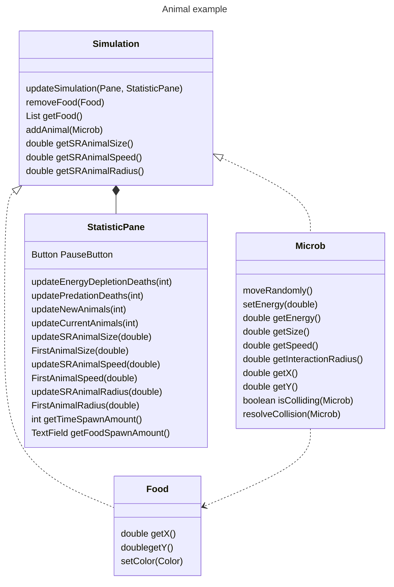

```mermaid
---
title: Animal example
---
classDiagram
Simulation <|.. Microb
Simulation <|.. Food
Simulation *-- StatisticPane
  
Microb ..> Food
  
  Microb : moveRandomly()
  Microb : setEnergy(double)
  Microb : double getEnergy()
  Microb : double getSize()
  Microb : double getSpeed()
  Microb : double getInteractionRadius()
  Microb : double getX()
  Microb : double getY()
  Microb : boolean isColliding(Microb)
  Microb : resolveCollision(Microb)
  
  Food : double getX()
  Food : doublegetY()
  Food : setColor(Color)
  
  StatisticPane : updateEnergyDepletionDeaths(int)
  StatisticPane : updatePredationDeaths(int)
  StatisticPane : updateNewAnimals(int)
  StatisticPane : updateCurrentAnimals(int)
  StatisticPane : updateSRAnimalSize(double)
  StatisticPane : FirstAnimalSize(double)
  StatisticPane : updateSRAnimalSpeed(double)
  StatisticPane : FirstAnimalSpeed(double)
  StatisticPane : updateSRAnimalRadius(double)
  StatisticPane : FirstAnimalRadius(double)
  StatisticPane : Button PauseButton
  StatisticPane : int getTimeSpawnAmount()
  StatisticPane : TextField getFoodSpawnAmount()
  
  Simulation : updateSimulation(Pane, StatisticPane)
  Simulation : removeFood(Food)
  Simulation : List<Food> getFood()
  Simulation : addAnimal(Microb)
  Simulation : double getSRAnimalSize()
  Simulation : double getSRAnimalSpeed()
  Simulation : double getSRAnimalRadius()
```